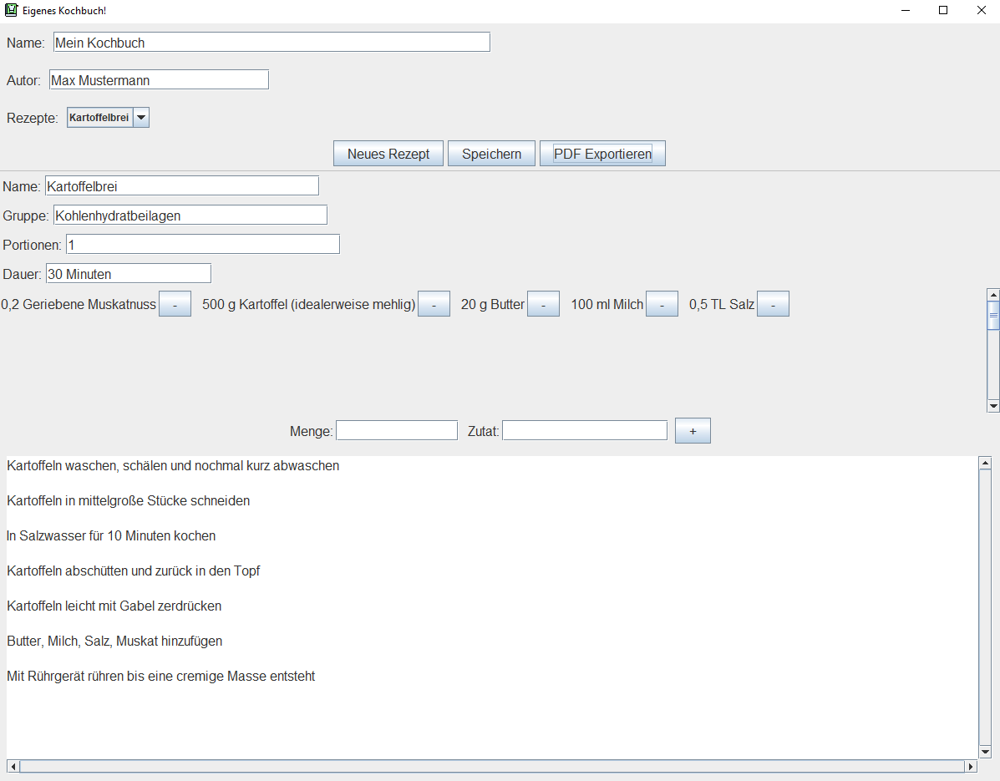

# Custom Cook Book
This project contains a UI to insert recipe data of a cook book, some metadata and function to transform this data into a minimalistic cook book PDF.

The UI looks like this (German)

and the corresponding generated PDF is [this](example-PDF.pdf).
The amount of recipes is not limited and the table of contents is adapted automatically.
Also, the recipe categories, the recipes inside a category and the ingredients of a recipe are sorted alphabetically.

Note that adding an image `title.png` to the same level of the runnable `.jar` or `.exe` uses it as a background for the title page.
A high quality DIN A4 background has the resolution `2480 x 3508` pixels.

## !!Important!!
The tool can only export to PDF if a LaTeX compiler, i.e., pdflatex, is globally installed on the system the tool is executed. For instance, via [MikTeX](https://miktex.org/).
